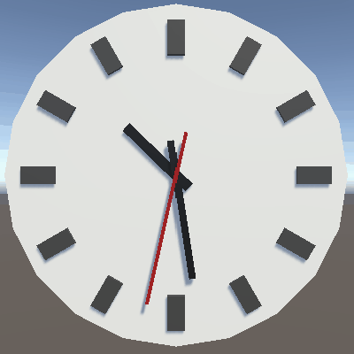
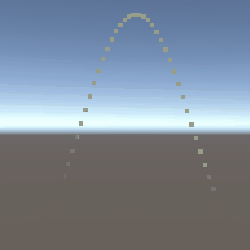
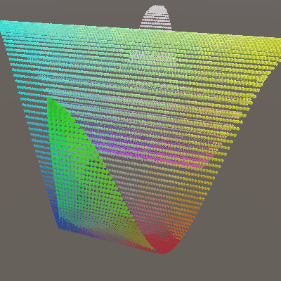
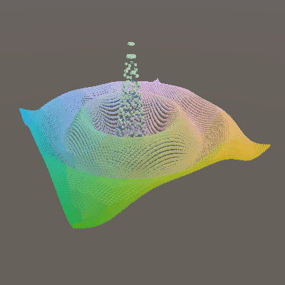
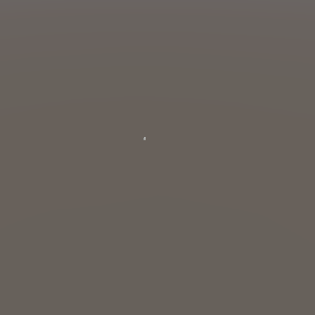
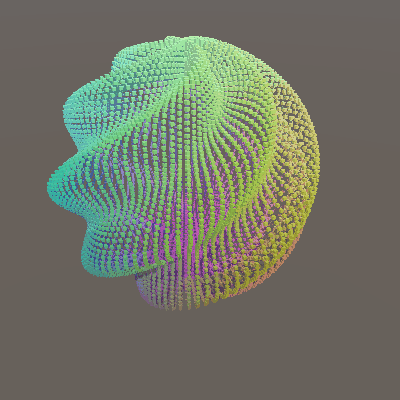
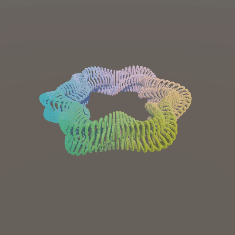
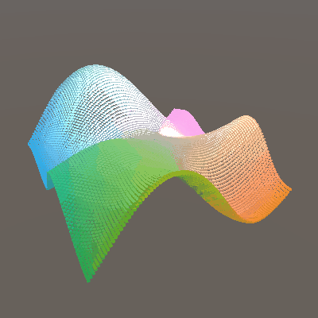
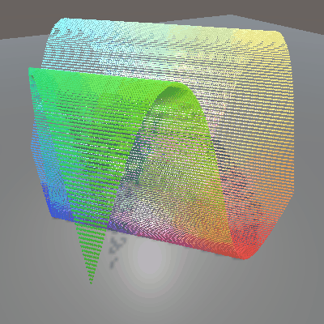

# Basics

Sourced from [Catlike Coding tutorials](https://catlikecoding.com/unity/tutorials/basics/) in 2022.

1. Clock

   
1. Graph

   
1. [Surfaces](demos/basics/3-surfaces/index.html);
   press number keys 1-6 to change the rendered shape.

    - 
    - 
    - 
    - 
    - 
    - 
1. [Performance](demos/basics/4-performance/index.html);
   number keys 1-6 still change the shape,
   but in addition the transition mode can be altered by pressing:

   - 'N' to disable the transition,
   - 'C' to cycle between the shapes,
   - 'R' for a random transition.

   
1. Compute Shaders

   
